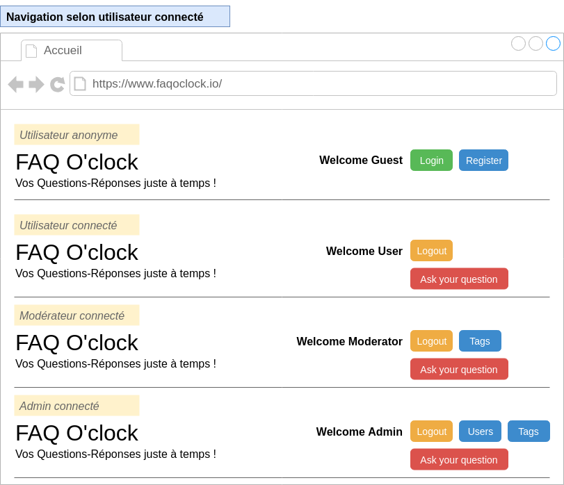
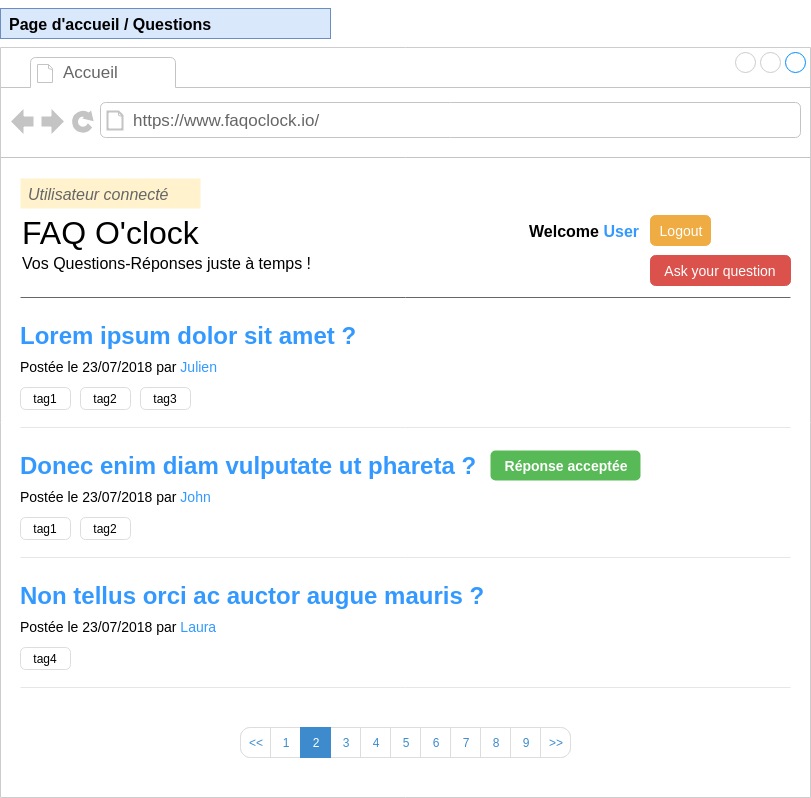
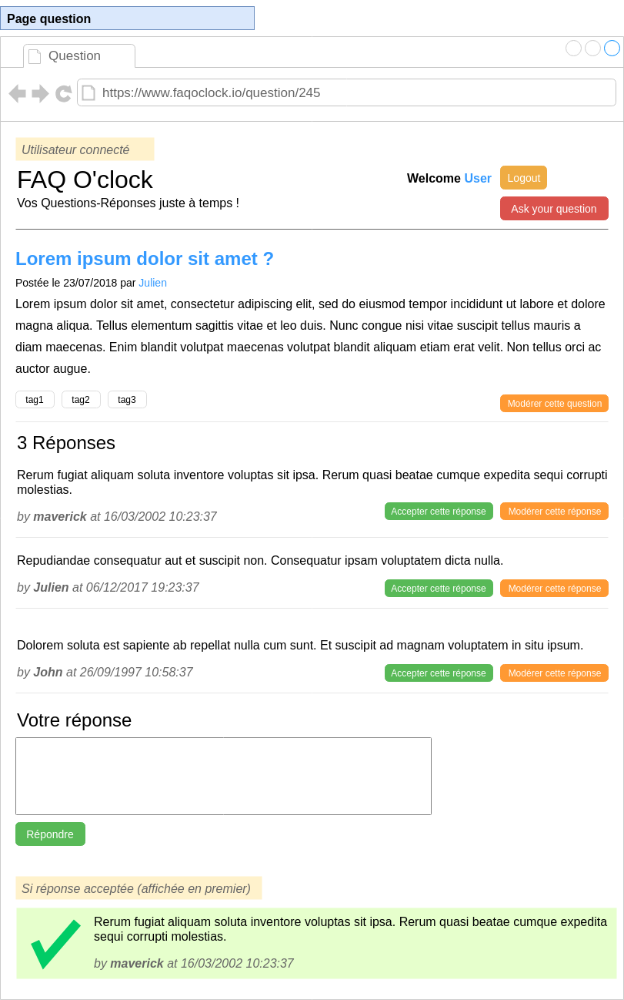
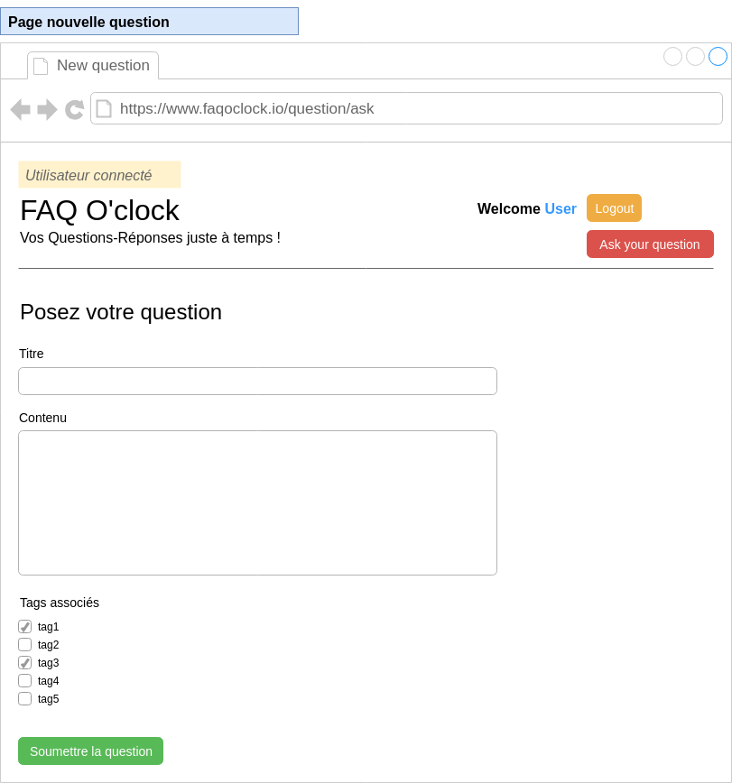
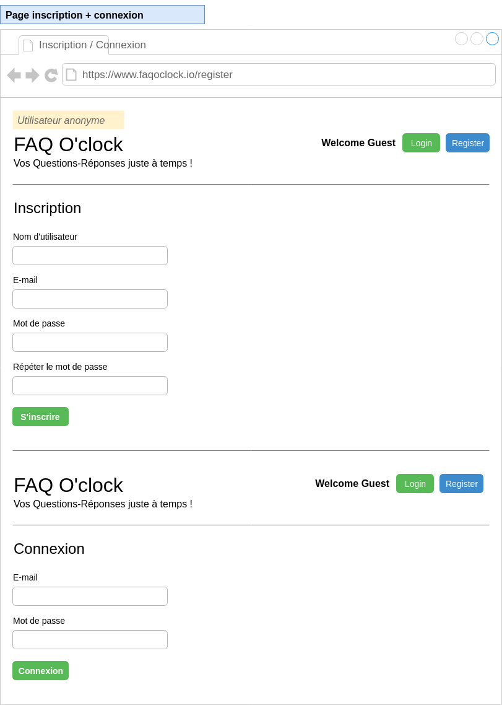
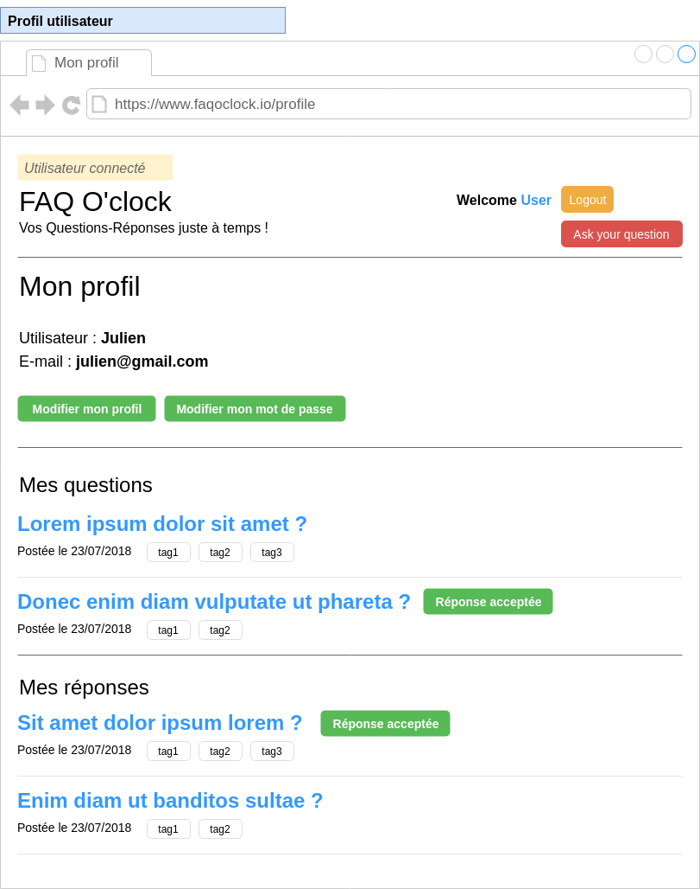

# Wireframes

> Wireframes possibles, issus de l'énoncé de l'évaluation. Les messages sur fond jaune pâle sont des annotations pour le développeur.

## Navigation

## Accueil/Questions

## Question

## Poser une question

## Inscription/Connexion

## Mon compte
